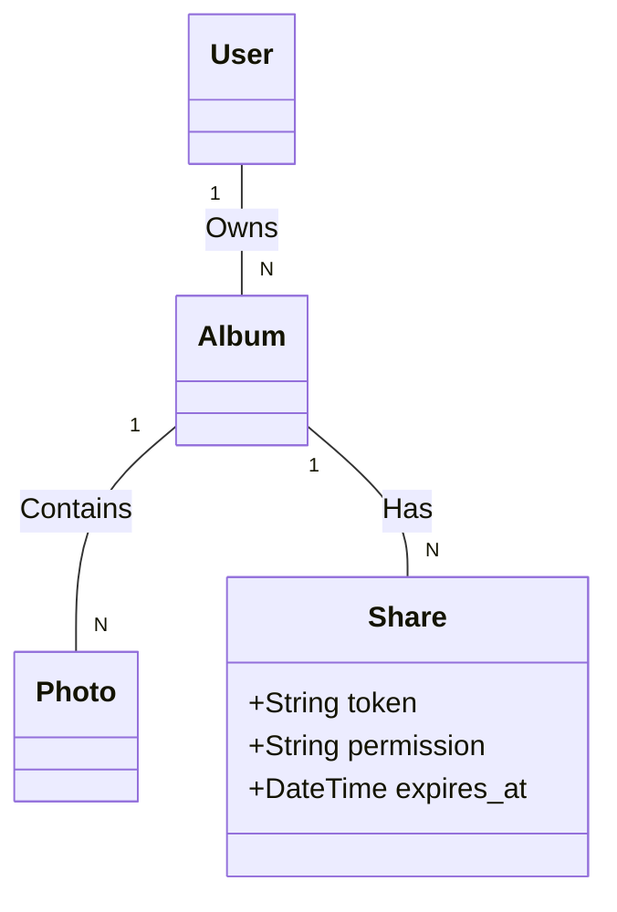

# 相册分享机制设计文档

本文档详细描述了系统中的相册分享机制，包括分享链接的生成、权限控制、有效期管理以及计费逻辑。

## 1. 核心概念

*   **相册 (Album)**: 资源的基本组织单元，归属于某个用户（Owner）。
*   **分享链接 (Share Link)**: 访问受限相册的凭证，通过 `share_token` 标识。
*   **权限 (Permission)**: 分享链接赋予访问者的能力，分为 `read_only` (仅查看) 和 `upload` (允许上传)。
*   **有效期 (Expiration)**: 分享链接的时效性，过期后失效。

## 2. 业务流程

### 2.1 创建分享 (Owner)
相册拥有者可以为特定相册创建分享链接。
*   **输入**: 相册 ID, 权限类型 (`read_only` / `upload`), 有效期 (可选)。
*   **输出**: 唯一的 `share_token`。
*   **逻辑**: 系统生成一个唯一的 Token 并存储在 `shares` 表中。

### 2.2 访问相册 (Visitor)
访问者通过分享链接查看相册内容。
*   **接口**: `GET /api/v1/photos?album_id={id}&share_token={token}`
*   **校验**:
    1.  Token 是否存在且匹配该相册。
    2.  Token 是否在有效期内。
    3.  如果校验通过，返回相册内的照片列表。

### 2.3 上传照片 (Visitor with Upload Permission)
如果分享链接具有 `upload` 权限，访问者可以向该相册上传照片。
*   **接口**: `POST /api/v1/photos`
*   **参数**: `file`, `album_id`, `share_token`
*   **校验**:
    1.  Token 是否存在、匹配相册且未过期。
    2.  Token 的权限字段 `permission` 是否为 `upload`。
*   **计费 (Billing)**:
    *   **存储空间扣减**: 照片占用的存储空间将从 **相册拥有者 (Owner)** 的配额中扣除，而不是上传者 (Visitor)。
    *   **原因**: 相册是 Owner 的资产，Visitor 只是贡献内容。这符合通常的共享相册逻辑（如 Google Photos 共享相册）。
*   **存储路径**:
    *   文件物理存储在 Owner 的存储路径下：`photos/{owner_id}/{photo_id}.jpg`。

## 3. 权限与安全

| 操作 | 相册拥有者 (Owner) | 访客 (Visitor) | 备注 |
| :--- | :--- | :--- | :--- |
| **查看照片** | ✅ 允许 (无需 Token) | ✅ 需有效 Token | 访客只能查看 Token 关联的相册内容 |
| **上传照片** | ✅ 允许 (无需 Token) | ⚠️ 需有效 Token + `upload` 权限 | 访客上传消耗 Owner 的存储空间 |
| **删除照片** | ✅ 允许 (所有照片) | ❌ 禁止 | 即使是自己上传的照片，目前逻辑也仅允许 Owner 删除 (可根据需求调整) |
| **管理分享** | ✅ 创建/删除分享 | ❌ 禁止 | 只有 Owner 能废弃分享链接 |

## 4. 数据模型关联

## 5. API 交互示例

### 场景：小明分享相册给小红

1.  **小明创建分享**:
    *   调用 `POST /shares/`
    *   Payload: `{ "album_id": "album_A", "permission": "upload" }`
    *   Response: `{ "token": "xyz123..." }`

2.  **小红查看相册**:
    *   调用 `GET /photos?album_id=album_A&share_token=xyz123...`
    *   Response: 照片列表

3.  **小红上传照片**:
    *   调用 `POST /photos`
    *   Form Data: `file=@photo.jpg`, `album_id=album_A`, `share_token=xyz123...`
    *   Result: 上传成功，小明的存储空间减少。

## 6. 特殊情况处理

*   **Token 过期**: 任何携带过期 Token 的请求都会返回 `403 Forbidden`。
*   **空间不足**: 如果相册拥有者的存储空间已满，即使访客有上传权限，上传也会失败 (返回 `403 Storage limit exceeded`)。
